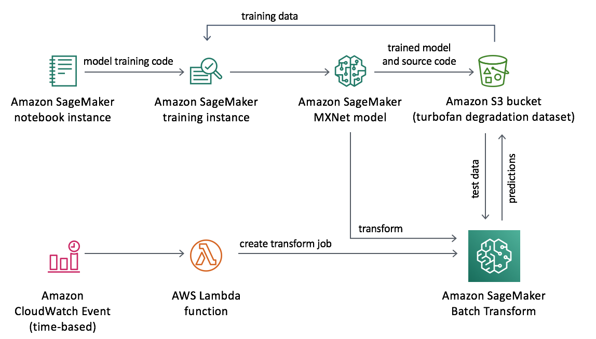

# 背景
许多公司依靠人员按照固定的时间时间间隔来执行常规诊断性测试和预防性维护。这可能是一个成本高昂，劳动密集型的过程，同时无法保证两次测试之间不会发生故障。
机器学习（ML）可以提供更可靠的预防性维护方法。机器学习模型可以使用传感器数据帮助预测资产故障的可能性，并优化维护程序的时间表。这种预测性维护可以帮助降低维护成本并减少计划外停机时间。

# 概览
Amazon SageMaker是一项完全托管的服务，使开发人员和数据科学家能够快速，轻松地构建，训练和部署任意规模的机器学习模型。 Amazon SageMaker消除了通常会降低希望使用机器学习的开发人员的障碍。此功能使Amazon SageMaker适用于各种用例，包括预测性维护。

为了帮助客户更轻松地利用Amazon SageMaker进行预测性维护，我们提供了使用机器学习的预测性维护解决方案。该解决方案可以帮助自动检测潜在的设备故障，并提供建议采取的措施。另外包括一个示例数据集，但是您可以修改该解决方案以与任何数据集一起使用。


## 架构图


### 架构描述
本解决方案使用 AWS CloudFormation模板从Amazon Simple Storage Service（Amazon S3）存储桶和带有ML模型的Amazon SageMaker终端节点。使用的样例数据集是来自NASA的涡轮风扇退化模拟示例数据集，本方案中的模型是在该数据集上进行训练以并预测设备的剩余使用寿命（RUL）。

在Amazon SageMaker中使用ml.t2.medium 实例类型的笔记本实例来进行模型的开发。使用 ml.p3.2xlarge Amazon SageMaker训练实例来执行训练任务。训练代码和训练模型存储在 S3存储桶中。

另外本解决方案还部署了配置了运行周期为每天运行一次的Amazon CloudWatch Events规则。规则配置为周期触发AWS Lambda函数，该函数创建Amazon SageMaker批处理转换作业，该作业使用训练后的模型从示例数据集中预测RUL。

## 组件
### Amazon SageMaker
使用机器学习进行预测性维护使用Amazon SageMaker笔记本实例，它是运行Jupyter笔记本的完全托管的机器学习（ML）Amazon Elastic Compute Cloud（Amazon EC2）计算实例。笔记本用于开发，训练和部署ML模型。默认情况下，该本方案使用ml.t2.medium实例。但是，您可以根据自己的特定需求修改以使用其他实例类型。

### 算法
借助于Amazon SageMaker，您可以使用深度学习框架来训练自定义深度学习模型。该解决方案利用自定义LSTM神经网络从时间序列数据中学习到设备从开始使用到产生故障的历史模式。该方案中的LSTM神经网络训练和推理代码是使用Apache MXNet深度学习框架实现的。 Apache MXNet是一个快速且可扩展的训练和推理框架，具有易于使用的简洁API，可用于机器学习。

### 数据集
使用机器学习进行预测性维护包含来自NASA的公共涡轮风扇退化模拟数据集，用于训练解决方案的机器学习（ML）模型并对该模型进行推理。该数据集是使用商业模块化航空推进系统仿真（C-MAPSS）进行的。该数据集从数个传感器读取数据，以模拟故障的变化过程。
该数据集合是在2008 年预测和健康管理会议 (PHM08) 上提出的一个用例。该数据集合是根据NASA太空探测机构基于现代燃气涡轮发动机上的各个传感器进行收集，以预测Turbofan发动机随时间推移可能出现的故障。借助该数据集，使用机器学习的算法训练模型，使用新的数据，预测一组涡轮风扇飞机发动机的剩余使用寿命（RUL）。数据集可从https://ti.arc.nasa.gov/m/project/prognostic-repository/CMAPSSData.zip下载


## 如何构建


* 请按照如下步骤:

```
cd deployment
chmod +x ./build-s3-dist.sh \n
./build-s3-dist.sh $TEMPLATE_BUCKET_NAME $DIST_OUTPUT_BUCKET $SOLUTION_NAME $VERSION \n
```

## 文件结构
```
├── deployment
│   ├── build-s3-dist.sh                                            [用于构建该解决方案]
│   ├── predictive-maintenance-using-machine-learning.yaml          [Cloudformation 文件]
│   └── run-unit-tests.sh                                           [用于单元测试]
└── source
    ├── notebooks
    │   ├── sagemaker_predictive_maintenance.ipynb                  [英文版 Jyputer notebook]
    │   ├── sagemaker_predictive_maintenance_chinese.ipynb          [中文版 Jyputer notebook]
    │   └── sagemaker_predictive_maintenance_entry_point
    └── predictive_maintenance                                      [Python 代码]
        ├── index.py
        ├── numpy
        ├── pandas
        └── pytz

```


## License

This library is licensed under the Apache 2.0 License. 
